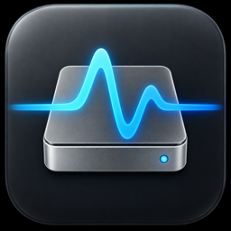

<p align="center">
  
</p>

<h1 align="center">LumeFS</h1>

<p align="center"><strong>Native macOS storage evidence for local AI workloads.</strong></p>

<p align="center">
  <a href="https://github.com/HEPHAISTOS89/LumeFS/actions/workflows/ci.yml"></a>
  
  
  
</p>

LumeFS is a native macOS storage monitor for local AI workloads. It brings
capacity, whole-device I/O, APFS metadata, NFS client counters, quota output,
and evidence-backed alerts into one SwiftUI application.

LumeFS is an observability tool. It does not repair disks, change mounts,
delete user files, or tune NFS. Its manual benchmark creates and removes one
app-owned temporary file. Alert recommendations are guidance, not automated
actions.

## The problem

Model training, checkpoints, datasets, and caches can consume local or shared
storage quickly. macOS exposes the relevant signals through several unrelated
interfaces, which makes it difficult to answer simple operational questions:

- Which visible volume is closest to full?
- Is the machine reading or writing heavily right now?
- Did the NFS client begin retrying or timing out?
- Is a displayed number live, unavailable, or from a controlled demonstration?

LumeFS collects those signals locally and presents the evidence next to the
alert that used it.

## What is implemented

- Overview of `/`, volumes mounted below `/Volumes`, and NFS mounts.
- APFS mount capacity plus SMART status, reserve, and quota metadata when
  `diskutil` provides those fields.
- Whole-device read/write rates and error counters from IOKit.
- System-wide NFS client RPC and NFSv4.1 layout counters from `nfsstat`.
- Per-mount NFS information (server, export, version, transport, mount
  parameters, kernel `dead` / `not responding` / `recovery` flags) from
  `nfsstat -m`, with alerts driven only by those kernel flags.
- Local process attribution: per-process disk read/write rates from
  `proc_pid_rusage` (name, PID, user, 2 s deltas), coverage counts for
  processes the kernel refuses without administrator rights, and a name-based
  “AI runtime?” hint (exo, openclaw, ollama, python, …) that is labeled as a
  heuristic.
- Per-user NFS attribution on a Mac that runs `nfsd` (`nfsstat -u`): user,
  export, masked client address, request and byte deltas, idle time, plus
  deterministic write-burst and request-burst alerts with documented, adjustable
  thresholds. Shown as unavailable, never simulated, on a pure client.
- Current-user quota rows parsed into byte limits when recognized, with raw
  evidence fallback and an explicit unavailable state.
- A 128 MiB bounded temporary-file benchmark with explicit `BENCHMARK`
  provenance and cleanup status.
- A workload-placement estimate with a 20% capacity margin and conservative current-user quota headroom when structured live limits match the volume.
- Opt-in FSEvents monitoring that reports aggregate operations under a selected
  root label without displaying event paths or reading file contents.
- A bundled pNFS JSON replay, visibly labeled `REPLAY`, for deterministic parser
  evidence when live pNFS counters are absent.
- Capacity, user-quota, storage-error, NFS-timeout, and NFS-retry alerts with evidence and a
  recommended next step.
- Alert history with an active / acknowledged / cleared lifecycle per
  occurrence, kept across launches in Application Support (500 entries, open
  alerts never trimmed), with an Acknowledge action that never silences a rule.
- Snapshot export to JSON or CSV (File menu, ⇧⌘E / ⌥⇧⌘E): every value the UI
  shows with its own timestamp and provenance, plus the alert history; NFS
  client addresses masked unless you opted into full addresses.
- Opt-in macOS notifications for critical alerts only: one per refresh, the
  same alert at most once per 10 minutes, title only, nothing requested from
  macOS until you turn it on.
- Native SwiftUI views for Overview, Volumes, I/O Performance, Attribution,
  Activity, and Alerts, plus a Settings window.

See [Metrics](docs/METRICS.md) for exact definitions and caveats.

## Data provenance

The model defines five provenance labels:

| Label | Meaning in the current code |
| --- | --- |
| `LIVE` | Collected on this Mac from a native API or an allowlisted system command. |
| `UNAVAILABLE` | Collection failed or the operating system did not provide the metric. |
| `BENCHMARK` | Produced by the app's bounded temporary-file benchmark. |
| `ESTIMATE` | Deterministic calculation from a chosen workload size and observed free capacity. |
| `REPLAY` | Decoded from the bundled pNFS JSON fixture, never presented as live. |

Throughput views derive provenance from the latest device sample and show
`UNAVAILABLE` when no sample exists. A `LIVE` sample still proves only that the
IOKit collector observed a whole device, not that a particular workload or pNFS
data path caused the activity.

## Architecture and sources

LumeFS uses no third-party runtime dependencies.

| Signal | Source | Scope |
| --- | --- | --- |
| Mounted volumes and capacity | `getfsstat(2)` | Visible APFS/NFS mounts |
| APFS metadata | `/usr/sbin/diskutil info -plist` | One discovered APFS mount at a time |
| Block I/O | IOKit `IOMedia` statistics | Whole devices, not individual processes or files |
| Process disk I/O | `sysctl(KERN_PROC_ALL)` + libproc `proc_pid_rusage` | Current user's processes (kernel `CHECK_SAME_USER`); other users counted as not permitted |
| NFS client metrics | `/usr/bin/nfsstat -f JSON -c` | System-wide cumulative client counters |
| NFS mount information | `/usr/bin/nfsstat -m -f JSON <mount point>` | One discovered NFS mount at a time: server, export, version, transport, parameters, kernel status flags |
| NFS users (server side) | `/usr/bin/nfsstat -u -n net -f JSON`, `/sbin/nfsd status` | Per user and client address, per export, on a Mac that runs `nfsd`; requests, bytes, idle; deltas over 3 s |
| Quota status | `/usr/bin/quota -uv` | Current user; recognized local/remote rows plus raw fallback |

The refresh loop runs once per second. Block I/O is sampled each refresh; process disk I/O every 2 cycles; mounts,
APFS metadata and NFS mount information are refreshed every 10 cycles, NFS client counters every 3 cycles, and quota
every 30 cycles after their initial collection.

Read [Architecture](docs/ARCHITECTURE.md) for the component and trust-boundary
details.

## Requirements

- macOS 14 or newer to run the app (deployment target 14.0).
- Xcode 16 or newer to build. CI builds and tests on the GitHub `macos-15`
  image (Xcode 16); the maintainer also validates on Xcode 26. Code that uses
  macOS 26 SDK symbols is guarded with `#if compiler(>=6.2)` so older
  toolchains keep compiling with a native fallback.
- XcodeGen only when regenerating `LumeFS.xcodeproj` from `project.yml`.

No NFS server is required to build or run the app. The optional local NFS lab
requires administrator authorization because it changes `/etc/exports`, starts
the macOS NFS daemon, and creates a local mount.

## Build and test

Run the bounded repository check:

```bash
./scripts/check.sh
```

It performs documentation/shell checks, a Debug build-for-testing, and one test
run. It does not retry failures. Build products are placed in a temporary
directory unless `LUMEFS_ARTIFACTS_DIR` is set.

To build directly from the checked-in Xcode project:

```bash
xcodebuild \
  -project LumeFS.xcodeproj \
  -scheme LumeFS \
  -configuration Debug \
  -destination 'platform=macOS' \
  -derivedDataPath DerivedData \
  build
```

To regenerate the project and run the app:

```bash
brew install xcodegen   # only if xcodegen is missing
make run
```

`make run` regenerates the Xcode project before building. Review the generated
project diff before committing it.

## Demo

Use the bounded [2–3 minute demo script](docs/DEMO.md). If an NFS mount is useful
for the demonstration, follow [the NFS lab procedure](docs/NFS_LAB.md) and run
its cleanup step afterward.

## Privacy and security

- Collection is local; the source tree contains no analytics or network client.
- LumeFS does not inspect file contents.
- Mount paths, device names, quota command output, and the current username can
  appear in the UI, in the alert-history file under Application Support, and in
  exports you save. Do not publish screenshots or exports without reviewing
  them. Notifications carry alert titles only.
- The app is currently built with the App Sandbox disabled because it reads
  system storage interfaces. Hardened Runtime is enabled.
- System commands are launched with `Process.executableURL` and argument arrays,
  not through a shell. The executable set is limited to `diskutil`, `nfsstat`,
  `nfsd` (`status` only) and `quota`.
- The runner enforces a per-command argument shape, rejects control characters,
  uses a minimal system-only environment, terminates after five seconds with
  SIGTERM/SIGKILL escalation, and caps stdout/stderr at one MiB each.

See [Security policy](.github/SECURITY.md) for reporting and the current security
boundary. The finite [verification and publication plan](docs/VERIFICATION.md)
defines the evidence required before release.

## Important limitations

- **pNFS platform limitation:** the installed `nfs(5)` manual on the validated macOS 26.6.2 host explicitly says pNFS is not supported by the native client. NFSv4.1 support and exposed layout fields do not establish pNFS capability. Clarify the expected client/API with the challenge sponsor.
- **pNFS counter interpretation:** non-zero NFSv4.1 layout counters mean that pNFS-related operations
  were observed somewhere on the client. They do not prove that a particular
  mount or current workload used a pNFS data path. The local lab validates NFSv3,
  not pNFS.
- Block-I/O metrics are whole-device totals. They are not per-volume,
  per-process, or specific to an AI workload.
- APFS capacity remains the `getfsstat` value; `diskutil` enriches metadata but
  does not replace capacity.
- Recognized quota rows are mapped by their filesystem string; unrecognized
  output remains one raw, all-filesystems message.
- Quota scope is the current user, not administration of all users. Soft limits are treated conservatively; grace periods and inode limits are not evaluated. A capacity estimate is not a write-permission guarantee.
- Settings appearance (System/Light/Dark), optional numeric animations, and thresholds are persisted and read on refresh; they are not versioned
  with historical alerts (a history entry does not record which threshold was
  in force when it was raised).
- Alert history clear times are refresh times; an alert still open when the app
  quits is closed at the first refresh after relaunch. Acknowledging is
  bookkeeping only and does not stop a rule from firing.
- Benchmark reads happen immediately after writes and may be served by the
  macOS cache; results are not raw-device performance.
- FSEvents monitoring is opt-in and aggregate, but selected root labels can still
  disclose folder names in the Activity view.
- The current test suite covers selected collectors, command shapes, benchmark
  guardrails/cleanup, FSEvents aggregation/redaction, alert thresholds,
  readiness calculations, formatting, structured quota rows, and NFS parsing.
  It is not an end-to-end proof of every live collector, pNFS environment, or UI
  flow.

## Future work

Ordered by expected value for administrators of local AI storage. Items marked
*platform* are limited by what macOS exposes, not by LumeFS.

1. **Validated pNFS topology** (*platform*): the native macOS client does not
   implement pNFS (`man 5 nfs`). LumeFS parses NFSv4.1 layout counters and ships
   a visibly labeled replay. A real metadata/data-server validation needs a
   different client or a sponsor-provided environment.
2. **Per-user quota administration**: `quota` reports only the current user
   without privileges. An explicit, permission-aware administrator path
   (`repquota -a` on volumes with quotas enabled, or server-side reports for NFS)
   is the next step; LumeFS will not request root silently.
3. **Sustained multi-run benchmark** with percentiles, device isolation and an
   explicit wall-clock budget, so GB/s claims can be defended beyond one bounded
   run.
4. **Alert delivery integrations** (log shipping to a SIEM, webhook or e-mail)
   built on the existing local alert history and JSON export, with the same
   opt-in and no-spam rules as the macOS notifications already implemented.
5. **APFS container view**: snapshots, encryption state and physical-store health
   in one place, read-only, using `diskutil apfs list -plist`.
6. **Time-to-full estimate** from the retained I/O and capacity history, labeled
   `ESTIMATE`.
7. **Comparative evaluation** of incident-diagnosis time against Activity Monitor
   plus command-line tools, with the same tasks and operators, before claiming
   any productivity gain.

## Project documents

- [Architecture](docs/ARCHITECTURE.md)
- [Metric definitions](docs/METRICS.md)
- [Demo script](docs/DEMO.md)
- [Local NFS lab and rollback](docs/NFS_LAB.md)
- [Maintainer validation record](docs/VALIDATION.md)
- [Verification and publication plan](docs/VERIFICATION.md)
- [Contributing](.github/CONTRIBUTING.md)
- [Security](.github/SECURITY.md)
- [Changelog](docs/CHANGELOG.md)

## License

LumeFS is available under the [MIT License](LICENSE).
